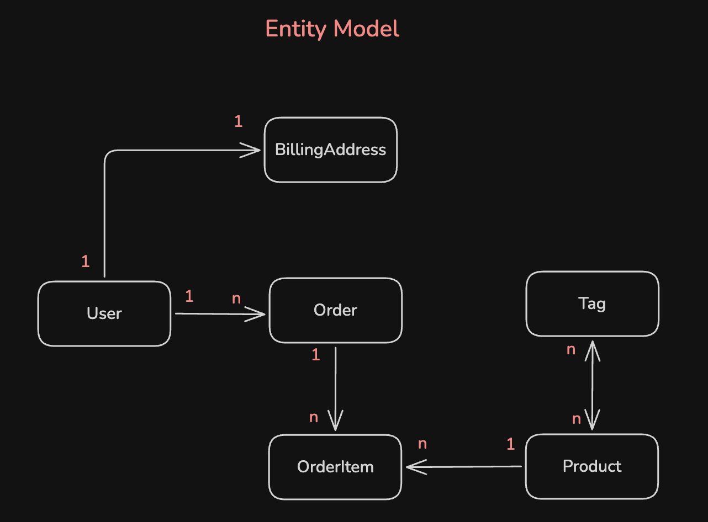

# Ecommerce JPA

Portfolio project built with Spring Boot to demonstrate practical Spring Data JPA mapping patterns in a small ecommerce domain.

The application exposes REST endpoints for users and orders, persists data in PostgreSQL, seeds sample products and tags, and includes a Bruno HTTP collection with ready-to-run requests.



## Main Objective

This project was created to demonstrate how to model relational database concepts with Spring Data JPA and Hibernate, including:

- Paginated list endpoints with `PageRequest` and Spring Data `Page`
- Entity relationships with `@OneToOne`, `@OneToMany`, `@ManyToOne`, and `@ManyToMany`
- Composite primary keys with `@Embeddable` and `@EmbeddedId`
- Foreign key mapping with `@JoinColumn`
- Join table mapping with `@JoinTable`
- Join table uniqueness with `@UniqueConstraint`
- Repository-based persistence with Spring Data JPA
- REST API design with Spring Web MVC
- PostgreSQL integration through Docker Compose

## Tech Stack

- Java 21
- Spring Boot 4.1.0
- Spring Web MVC
- Spring Data JPA
- Hibernate
- PostgreSQL
- Docker Compose
- Maven Wrapper
- Bruno HTTP collection

## Domain Model

The project models a simplified ecommerce flow:

- `UserEntity` represents a customer.
- `BillingAddressEntity` stores the user's billing address.
- `OrderEntity` represents an order placed by a user.
- `OrderItemEntity` represents products inside an order.
- `OrderItemId` defines a composite key for order items.
- `ProductEntity` represents products available for purchase.
- `TagEntity` classifies products.

### JPA Relationships Demonstrated

| Relationship | Implementation |
| --- | --- |
| `@OneToOne` | `UserEntity` to `BillingAddressEntity` |
| `@ManyToOne` | `OrderEntity` to `UserEntity` |
| `@OneToMany` | `OrderEntity` to `OrderItemEntity` |
| `@ManyToOne` inside composite key | `OrderItemId` to `OrderEntity` and `ProductEntity` |
| `@ManyToMany` | `ProductEntity` to `TagEntity` |
| `@JoinColumn` | User billing address, order user, order item order/product |
| `@JoinTable` | Product tags through `products_tags` |
| `@UniqueConstraint` | Prevents duplicated product/tag pairs in `products_tags` |
| `@Embeddable` | `OrderItemId` composite key class |
| `@EmbeddedId` | `OrderItemEntity` primary key |

## API Overview

Base URL:

```text
http://localhost:8080
```

Available endpoints:

| Method | Endpoint | Description |
| --- | --- | --- |
| `POST` | `/users` | Create a user with billing address |
| `GET` | `/users/{userId}` | Get a user by UUID |
| `DELETE` | `/users/{userId}` | Delete a user by UUID |
| `POST` | `/orders` | Create an order for an existing user |
| `GET` | `/orders?page=0&pageSize=10` | List orders with pagination |
| `GET` | `/orders/{orderId}` | Get order details by ID |

## HTTP Collection

The `collection` folder contains the available HTTP requests created with Bruno.

To use it:

1. Open Bruno.
2. Choose `Open Collection`.
3. Select the `collection` folder from this project.
4. Run the requests against `http://localhost:8080`.

The collection is stored as OpenCollection/Bruno YAML files. Other HTTP clients may not import it directly, but the requests can be recreated from the API overview above.

## Running Locally

### Prerequisites

Make sure you have installed:

- Java 21
- Docker and Docker Compose

You do not need to install Maven globally because the project includes the Maven Wrapper.

### 1. Start PostgreSQL

From the project root, run:

```bash
docker compose -f docker/docker-compose.yml up -d
```

### 2. Run the Application

```bash
./mvnw spring-boot:run
```

The API will be available at:

```text
http://localhost:8080
```

### 3. Seed Data

The application uses `src/main/resources/data.sql` to insert sample products, tags, and product/tag relationships.

Spring is configured to run the SQL initialization on startup:

```properties
spring.sql.init.mode=always
spring.jpa.defer-datasource-initialization=true
```

### 4. Stop PostgreSQL

```bash
docker compose -f docker/docker-compose.yml down
```

## Project Structure

```text
.
+-- collection/                 # Bruno HTTP collection
+-- docker/                     # Docker Compose configuration for PostgreSQL
+-- src/main/java/.../controller # REST controllers
+-- src/main/java/.../dto        # Request and response DTOs
+-- src/main/java/.../entity     # JPA entities and mappings
+-- src/main/java/.../repository # Spring Data repositories
+-- src/main/java/.../service    # Application business logic
+-- src/main/resources/data.sql  # Seed data
`-- entity-model.png             # Database/entity relationship model
```

## Portfolio Notes

This project highlights backend fundamentals expected in production Java applications:

- Clear separation between controllers, services, repositories, DTOs, and entities
- Relational modeling with multiple JPA association types
- Composite key modeling for order items
- Pagination for list endpoints
- PostgreSQL-backed persistence
- Dockerized local infrastructure
- Reproducible local execution through Maven Wrapper and Docker Compose
